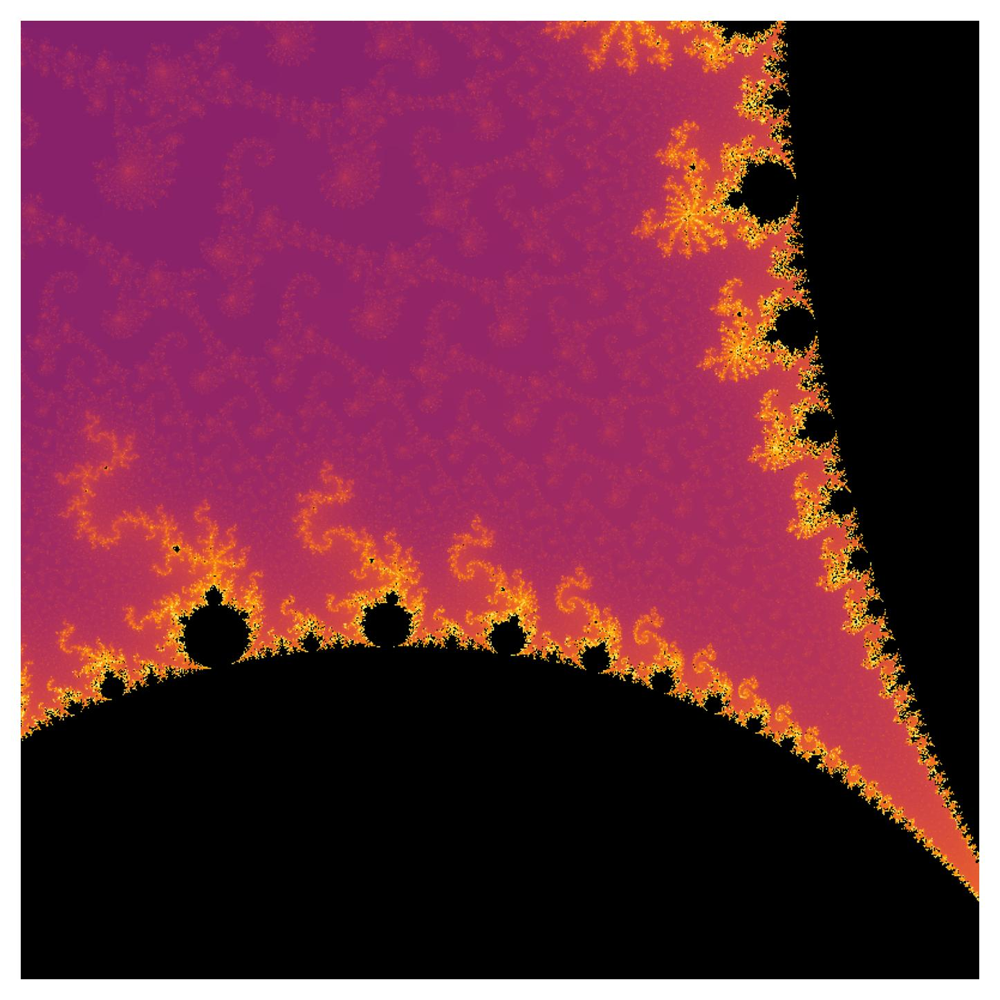

# Mandelbrot 

Visualization of the Mandelbrot Set with Python and Node-JS



## Installation 

### Node Package

```
cd js-mandelbrot
npm install 

```

### Python Package

```
cd py-mandelbrot
pip install .

```

## Usage

### Generate Mandelbrot Data

```
node js-mandelbrot/bin/mandelbrot.js \             
  -x -0.7435669 -y 0.1314023 \
  -w 0.0022878 -h 0.0022878 \
  -s 1e-5 \
  -n 2000 \
> seahorse_tail.json
```

### Visualization 

```
mandelbrot-vis seahorse_tail.json seahorse_tail.png
```

### Pre-Configured Bash Script

TODO ... 
